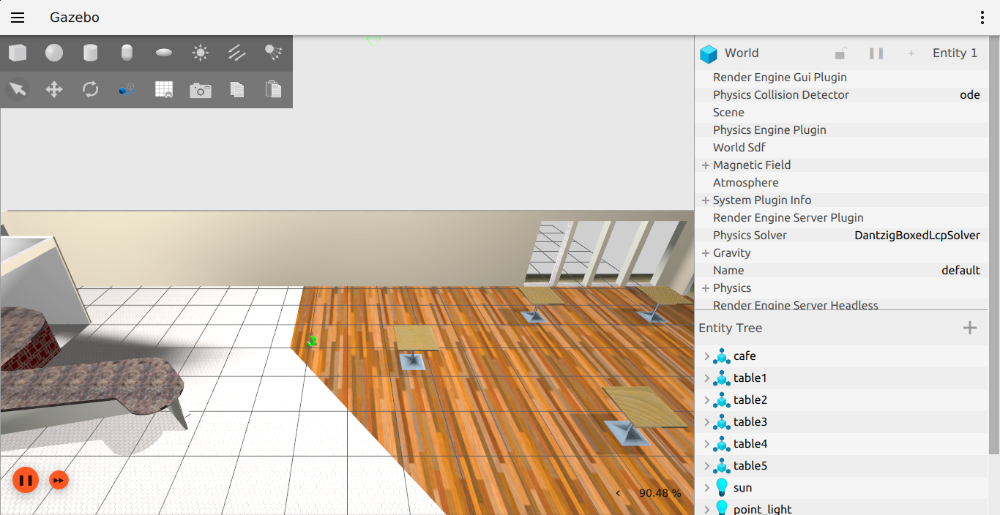
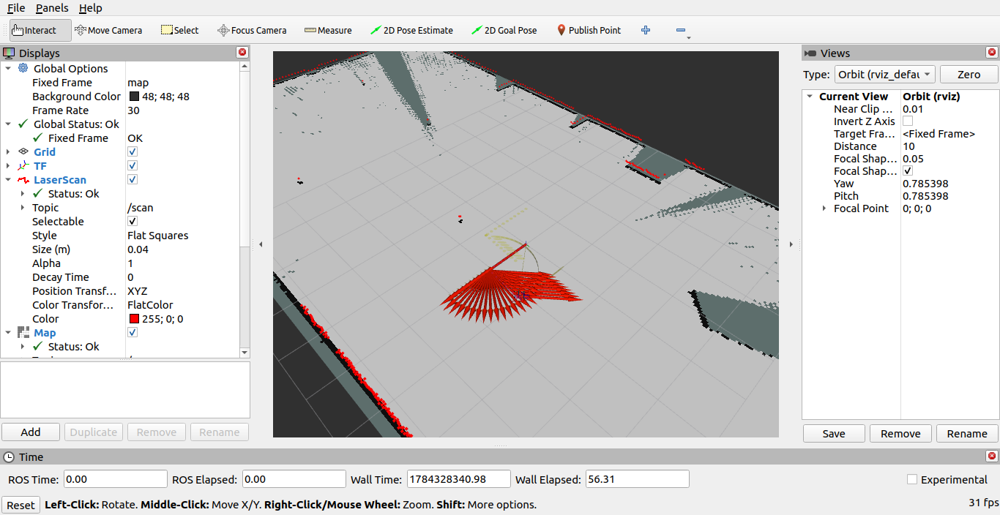

# yahboom_rosmaster_slam


Basic 2D LiDAR SLAM for the Yahboom ROSMASTER X3 mecanum robot, built on top
of the [`yahboom_rosmaster`](https://github.com/AIRclub-UdeSA/yahboom_rosmaster)
Gazebo Fortress simulator and [`slam_toolbox`](https://github.com/SteveMacenski/slam_toolbox).

This repository is independent of `yahboom_rosmaster` (its own history, its
own remote) but builds inside the same ROS 2 workspace via a symlink. It does
not modify anything in the simulator repository.

## How this fits into the workspace

`yahboom_rosmaster_slam` is a normal `ament_cmake` package. `colcon` only
discovers packages under a workspace's `src/` directory, but that entry does
not need to be a real directory — a symlink works too. Keep this repo wherever
you like (e.g. `~/Downloads/AIRClub/yahboom_rosmaster_slam`) and link it into
the workspace:

```bash
ln -s /path/to/yahboom_rosmaster_slam ~/rosmaster_ws/src/yahboom_rosmaster_slam
```

`git` operations (push/pull/commit) always act on the real directory, so this
repo's history stays completely separate from `yahboom_rosmaster`'s.

## Requirements

- Ubuntu 22.04, ROS 2 Humble, Gazebo Fortress (same as `yahboom_rosmaster`)
- The `yahboom_rosmaster` simulator already built in the same workspace
- `ros-humble-slam-toolbox` and `ros-humble-nav2-map-server`

```bash
sudo apt update
sudo apt install -y ros-humble-slam-toolbox ros-humble-nav2-map-server
```

## Build

```bash
ln -s /path/to/yahboom_rosmaster_slam ~/rosmaster_ws/src/yahboom_rosmaster_slam

cd ~/rosmaster_ws
source /opt/ros/humble/setup.bash
rosdep update
rosdep install --from-paths src --ignore-src -r -y --rosdistro humble

colcon build --symlink-install --packages-up-to yahboom_rosmaster_slam
source install/setup.bash
```

Source both overlays in every new terminal:

```bash
source /opt/ros/humble/setup.bash
source ~/rosmaster_ws/install/setup.bash
```

## Screenshots

Gazebo (cafe world) alongside RViz building the occupancy map live as the
robot explores:

| Gazebo (cafe world) | RViz (live SLAM map) |
|----------------------|-----------------------|
|  |  |

## Quick Start

Launch the simulator and SLAM together in one command (default: empty world,
RViz open):

```bash
ros2 launch yahboom_rosmaster_slam slam.launch.py
```

This starts:

1. The `yahboom_rosmaster_gazebo` simulator (`rosmaster_gazebo_fortress.launch.py`,
   with its own RViz disabled since this launch file brings its own view).
2. `slam_toolbox`'s `async_slam_toolbox_node`, consuming `/scan` and the
   `odom -> base_footprint` TF that the simulator already publishes.
3. RViz, preconfigured (`rviz/slam_view.rviz`) to show the live occupancy grid,
   laser scan, robot model, and TF tree.

If you already have the simulator running in another terminal, skip starting
a second instance:

```bash
ros2 launch yahboom_rosmaster_slam slam.launch.py start_simulator:=false
```

### Driving the robot while mapping

In a second sourced terminal, drive the robot around to build up the map
(see the simulator's own README for the full holonomic keybindings):

```bash
sudo apt install -y ros-humble-teleop-twist-keyboard   # if not already installed
ros2 run teleop_twist_keyboard teleop_twist_keyboard
```

Watch the map grow in RViz as you explore. Move slowly and try to close loops
(revisit previously mapped areas) for `slam_toolbox`'s loop closure to
correct any accumulated drift.

### Launching in the cafe world

```bash
ros2 launch yahboom_rosmaster_slam slam.launch.py \
  world:="$(ros2 pkg prefix yahboom_rosmaster_gazebo)/share/yahboom_rosmaster_gazebo/worlds/cafe.world"
```

### Launch Arguments

| Argument | Default | Description |
|----------|---------|--------------|
| `start_simulator` | `true` | Launch `yahboom_rosmaster_gazebo` alongside SLAM |
| `world` | `worlds/empty.world` | Absolute path to the Gazebo world file (only used if `start_simulator:=true`) |
| `headless` | `false` | Run the Gazebo server without its GUI client |
| `use_sim_time` | `true` | Use the Gazebo simulation clock |
| `slam_params_file` | `config/slam_toolbox_params.yaml` | slam_toolbox parameters |
| `open_rviz` | `true` | Start the bundled RViz SLAM view |
| `rviz_config_file` | `rviz/slam_view.rviz` | RViz configuration to use |

## Saving the Map

Once you're happy with the built map, save it to disk:

```bash
ros2 run yahboom_rosmaster_slam save_map.sh ~/rosmaster_ws/my_map
# or directly:
ros2 run nav2_map_server map_saver_cli -f ~/rosmaster_ws/my_map
```

This writes `my_map.yaml` and `my_map.pgm`, in the same format consumed by
`yahboom_rosmaster_navigation`'s map files
(`yahboom_rosmaster_navigation/maps/*.yaml`).

## Localization Mode

Besides online mapping, this package can also run slam_toolbox in
**localization mode**: correcting the robot's pose against a map you already
built, instead of building a new one. This is slam_toolbox's own native
localization (`localization_slam_toolbox_node`), not Nav2's AMCL — there is
no particle filter and no global relocalization. You seed it with an
approximate starting pose and it scan-matches from there.

### 1. Build and serialize a map

Map as usual with `slam.launch.py` (see Quick Start above). Then, from the
same terminal you'll later launch localization from, serialize the
pose-graph:

```bash
cd ~/rosmaster_ws   # or wherever you'll run localization.launch.py from
ros2 run yahboom_rosmaster_slam serialize_map.sh my_map
```

This writes `my_map.posegraph` and `my_map.data` in the current directory.
Unlike `save_map.sh` above (which exports a static `nav2_map_server` pgm/yaml
raster for Nav2/AMCL), this preserves slam_toolbox's full pose-graph so it
can resume scan-matching later.

**slam_toolbox resolves `map_file_name` relative to the node's own working
directory, and does not honor absolute paths** — passing an absolute path
does not override the working directory, it gets concatenated onto it,
silently pointing at the wrong file. Always `cd` into the map's directory
before launching (either mapping or localization) and use a bare filename.

### 2. Localize against it

From that same directory:

```bash
ros2 launch yahboom_rosmaster_slam localization.launch.py \
  map_file_name:=my_map \
  map_start_pose:="[0.0, 0.0, 0.0]"
```

`map_file_name` and `map_start_pose` are both required (no defaults). Set
`map_start_pose` to the robot's actual starting `[x, y, yaw]` in the map
frame — if it's off, localization won't converge, since this isn't a global
relocalizer. As with `slam.launch.py`, add `start_simulator:=false` if the
simulator is already running elsewhere.

### Launch Arguments

| Argument | Default | Description |
|----------|---------|--------------|
| `start_simulator` | `true` | Launch `yahboom_rosmaster_gazebo` alongside SLAM |
| `world` | `worlds/empty.world` | Absolute path to the Gazebo world file (only used if `start_simulator:=true`) |
| `headless` | `false` | Run the Gazebo server without its GUI client |
| `use_sim_time` | `true` | Use the Gazebo simulation clock |
| `slam_params_file` | `config/slam_toolbox_localization_params.yaml` | slam_toolbox parameters |
| `map_file_name` | *(required)* | Serialized map filename prefix, resolved relative to the launch working directory |
| `map_start_pose` | *(required)* | Initial `[x, y, yaw]` pose (map frame) to seed localization from |
| `open_rviz` | `true` | Start the bundled RViz SLAM view |
| `rviz_config_file` | `rviz/slam_view.rviz` | RViz configuration to use |

## Verifying SLAM Is Running

```bash
ros2 topic hz /map
ros2 topic echo /map --once
ros2 run tf2_ros tf2_echo map odom
```

`slam_toolbox` publishes the `map -> odom` transform; the simulator's own
`wheel_state_odometry.py` continues to own `odom -> base_footprint`. Together
these give a complete `map -> odom -> base_footprint` chain.

## How It Works

```text
/scan (simulator LiDAR, 720 samples, 2D)  ─┐
                                             ├─> async_slam_toolbox_node ─> /map, map -> odom TF
odom -> base_footprint TF (wheel odometry) ─┘
```

`slam_toolbox` is configured (`config/slam_toolbox_params.yaml`) for:

- `odom_frame: odom`, `base_frame: base_footprint`, `map_frame: map`,
  `scan_topic: /scan` — matching the simulator's published frames/topics
  exactly (see `yahboom_rosmaster`'s README for its full TF/topic reference).
- `mode: mapping` (online asynchronous mapping, not localization against a
  pre-built map).
- `minimum_travel_distance`/`minimum_travel_heading` lowered from the
  stock defaults (0.2 m / 0.2 rad vs. 0.5 / 0.5) since the ROSMASTER X3 is a
  small base operating in tight indoor spaces and benefits from more frequent
  scan matching.
- `max_laser_range: 12.0` — bounded well under the simulated LiDAR's 30 m
  sensor range to keep rasterized maps a reasonable size for the empty/cafe
  worlds.

Localization mode (`config/slam_toolbox_localization_params.yaml`) shares all
of the above, plus a smaller scan buffer and loop-closure chain size
(consuming a pre-built map instead of growing one from scratch needs less
history):

```text
/scan (simulator LiDAR, 720 samples, 2D)  ─┐
                                             ├─> localization_slam_toolbox_node ─> /map, map -> odom TF
odom -> base_footprint TF (wheel odometry) ─┘         ^
                                                       │
                       serialized map (map_file_name) ┘ loaded at startup, seeded by map_start_pose
```

## Known Limitations

- `localization.launch.py` uses slam_toolbox's own localization mode, seeded
  with a manually supplied starting pose — it is not global (AMCL-style)
  relocalization, and there is still no autonomous exploration. For
  Nav2-based navigation (path planning, `nav2_amcl`, etc.), combine a saved
  `nav2_map_server` map (`save_map.sh`) with `yahboom_rosmaster_navigation`'s
  Nav2 stack instead.
- Inherits the simulator's own caveats (see `yahboom_rosmaster`'s README,
  "Current Project Status"): the drivetrain, LiDAR, and IMU are nominal,
  uncalibrated models, not validated against the physical ROSMASTER X3.
- Tuned and tested against the empty and cafe Fortress worlds only.
- `rviz/slam_view.rviz` intentionally omits the `RobotModel` display and
  slam_toolbox's own `SlamToolboxPlugin` RViz panel. Both reliably crashed
  RViz (segfault) when tested against this simulator on an Intel Iris Plus
  (Mesa/i915) GPU; TF axes and the LaserScan fan already show the robot's
  live pose without them. If your system doesn't hit this, add them back
  via RViz's Panels/Displays "Add" buttons.

## Continuous Integration

`.github/workflows/ci.yml` builds this package and runs `ament_lint_auto`
(copyright is intentionally disabled in `CMakeLists.txt`; xmllint, cmake
lint, flake8, and pep257 all run) on every push and pull request, in a clean
`ros:humble-ros-base` container. `yahboom_rosmaster_gazebo` is skipped via
`rosdep --skip-keys` since it's a separate, non-rosdep-indexed sibling repo
(see "How this fits into the workspace") needed to run the launch files, not
to build or lint this one.

Reproduce it locally from a workspace with this package under `src/`:

```bash
rosdep install --from-paths src --ignore-src -r -y --skip-keys yahboom_rosmaster_gazebo
colcon build --packages-select yahboom_rosmaster_slam
colcon test --packages-select yahboom_rosmaster_slam
colcon test-result --verbose
```

## Repository Layout

| Path | Contents |
|------|----------|
| `launch/slam.launch.py` | Mapping launch file: simulator (optional) + slam_toolbox mapping + RViz |
| `launch/localization.launch.py` | Localization launch file: simulator (optional) + slam_toolbox localization + RViz |
| `config/slam_toolbox_params.yaml` | slam_toolbox mapping-mode parameters tuned for the ROSMASTER X3 |
| `config/slam_toolbox_localization_params.yaml` | slam_toolbox localization-mode parameters tuned for the ROSMASTER X3 |
| `rviz/slam_view.rviz` | RViz view: Map, LaserScan, Odometry, TF (see "Known Limitations" for why RobotModel is omitted) |
| `scripts/save_map.sh` | Convenience wrapper around `nav2_map_server`'s `map_saver_cli` (pgm/yaml, for Nav2/AMCL) |
| `scripts/serialize_map.sh` | Convenience wrapper around slam_toolbox's `SerializePoseGraph` service (for `localization.launch.py`) |
| `.github/workflows/ci.yml` | GitHub Actions: builds the package and runs `ament_lint_auto` on every push/PR |

## License

BSD-3-Clause. See `LICENSE`.
